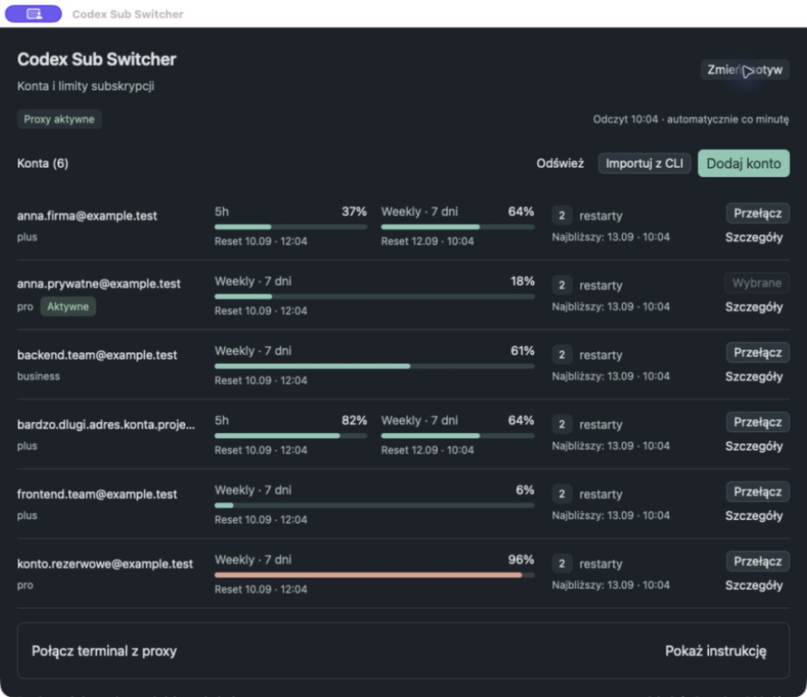

# Codex Sub Switcher

Natywna aplikacja macOS w Rust / GPUI Kit, która przełącza konta subskrypcyjne używane przez Codex CLI. Lokalne proxy wybiera konto dla każdego nowego żądania; przełączenie nie restartuje CLI i nie przerywa już rozpoczętej odpowiedzi.



## Uruchomienie

Wymagane: macOS, Rust/Cargo i zainstalowany Codex CLI. Integrację sprawdzono z **Codex CLI 0.154.0**.

```sh
scripts/bundle.sh
open 'dist/Codex Sub Switcher.app'
```

Do pracy nad kodem: `cargo run --locked`. Paczka aplikacji jest podpisywana ad hoc lokalnie; nie jest notaryzowanym wydaniem do dystrybucji.

1. Kliknij **Dodaj konto** i dokończ zwykłe logowanie Codex w przeglądarce. Powtórz dla drugiego konta. Każde logowanie ma osobny katalog roboczy i nie wylogowuje zwykłego CLI.
2. Kliknij **Przełącz** przy wybranym koncie.
3. Wybierz jeden sposób połączenia terminala opisany poniżej.
4. Przy wyczerpaniu limitu kliknij **Przełącz** przy drugim koncie. Kolejne żądanie użyje tego konta. Nie ma automatycznego przełączania ani ponawiania generacji po błędzie limitu.

Aplikacja musi pozostawać uruchomiona podczas używania proxy. Czerwony przycisk zamknięcia okna chowa ją do paska menu macOS, usuwa ikonę z Docka oraz zachowuje stan okna, proxy i odświeżanie limitów. Menu **⇄** pokazuje aktywne konto, jego limity i terminy resetów bez otwierania okna. Kliknij je, aby wybrać **Pokaż okno**, **Schowaj okno** lub **Zakończ Codex Sub Switcher**. Ponowne pokazanie okna z menu paska przywraca ikonę w Docku. Dopiero **Zakończ** lub **⌘Q** zatrzymuje proxy. Żółty przycisk zachowuje standardową minimalizację macOS do Docka. Jeśli utworzenie ikony tray’a zawiedzie, zamknięcie okna nadal kończy aplikację, aby nie zostawić jej bez dostępu do sterowania.

### Bez zmiany konfiguracji

Kliknij **Kopiuj polecenie** i wklej je w terminalu w katalogu projektu. Launcher `codex-switch` przekazuje argumenty do prawdziwego CLI. Możesz dopisać `resume`, `resume --last` lub inne zwykłe argumenty Codex.

Zwykłe polecenie `codex` nadal używa dotychczasowej konfiguracji. Proces już uruchomiony poza proxy trzeba jednorazowo zakończyć i wznowić przez launcher; potem zmiany kont nie wymagają restartu.

### Opcjonalny patch `config.toml`

Kliknij **Włącz w config.toml** i potwierdź zmianę pokazaną w oknie. Aplikacja:

- tworzy prywatną kopię konfiguracji;
- zmienia domyślny `model_provider` na `subscription_switcher`;
- dodaje konfigurację dostawcy Responses kierującą na `127.0.0.1`;
- ustawia pomocnicze polecenie dostarczające klucz lokalnego proxy, bez tokenów OAuth w `config.toml`;
- zachowuje komentarze i pozostałe ustawienia.

Od tego momentu **nowo uruchamiane zwykłe `codex` z dowolnego katalogu** używa proxy, o ile konfiguracja projektu, wybrany profil lub argument `-c` nie nadpisują dostawcy. Wybór dotyczy `CODEX_HOME` widocznego w dialogu.

**Przywróć config.toml** odtwarza poprzedni wybór dostawcy i usuwa własną sekcję proxy, zachowując inne późniejsze edycje. Gdy ktoś ręcznie zmieni sekcję proxy, aplikacja odmawia jej nadpisania i zachowuje kopię. Kopie konfiguracji pozostają w katalogu danych aplikacji. Przed przeniesieniem/usunięciem aplikacji należy przywrócić konfigurację, ponieważ wskazuje ona bezwzględną ścieżkę do pliku wykonywalnego.

## Granice działania

- Wybór konta dotyczy wszystkich terminali korzystających z tego proxy. Żądanie rozpoczęte przed kliknięciem jest przypisane do poprzedniego konta, również podczas odświeżania tokenu.
- Proxy obsługuje listę modeli, Responses przez HTTP/SSE oraz endpoint kompaktowania. WebSocket jest wyłączony w konfiguracji dostawcy. Identyfikatory kontynuacji `previous_response_id` są odrzucane: wymagane jest przesłanie historii przez CLI.
- Rozmowa, narzędzia, pliki i uprawnienia pozostają po stronie CLI. Proxy nie modyfikuje historii ani zapisów sesji. Pełny scenariusz długiej rozmowy z kompakcją i zmianą **dwóch rzeczywistych kont** wymaga dalszej weryfikacji.
- Karta konta pokazuje plan zapisany przy logowaniu oraz bieżące procentowe zużycie okien zwróconych przez usługę limitów Codex (np. 5h i weekly). Nie zakłada dostępności okna na podstawie planu. Reset ma lokalną datę, godzinę i czas pozostały; przekroczenie daty nie zeruje samodzielnie zużycia. Dane są odświeżane po otwarciu, po operacjach na kontach, co minutę po zakończeniu poprzedniego odczytu oraz przyciskiem **Odśwież limity**. Błąd zachowuje ostatni wynik z oznaczeniem nieaktualności. Brak okien w odpowiedzi nie oznacza nieograniczonej subskrypcji.
- Liczniki w nagłówku dotyczą wyłącznie ruchu generacji tego proxy. `/status` CLI nie jest źródłem informacji o wybranym koncie proxy. Instrukcja połączenia terminala jest dostępna pod **Pokaż instrukcję**.
- Wycofane lub nieważne logowanie wymaga ponownego dodania konta. Odświeżanie tokenów jest automatyczne, z zapisem rotowanego refresh tokenu i jednym ponowieniem po HTTP 401, zanim zacznie płynąć odpowiedź.
- **Importuj konto CLI** obsługuje magazyn `file`. To migracja istniejącego logowania: nie używaj jednocześnie jego kopii w starych procesach CLI i proxy, ponieważ odświeżanie może rotować wspólny refresh token. Do niezależnego równoległego użycia wybierz **Dodaj konto**. `keyring`, `auto` i `ephemeral` nie są importowane.
- Proxy obejmuje ruch do dostawcy modelu. Nie zastępuje tożsamości używanej przez inne usługi Codex, np. zadania cloud i konektory.

## Ręczne restarty limitów

Każdy wiersz konta pokazuje liczbę restartów i najbliższy termin. **Szczegóły** rozwija wszystkie daty ważności oraz przycisk użycia restartu. Lista jest uporządkowana według dokładnego terminu wygaśnięcia, z restartami bez daty na końcu. **Następny do użycia** oznacza najwcześniej wygasający dostępny restart typu `codex_rate_limits`; wygasłe, wykorzystane i nieznane typy nie są wybierane.

**Użyj restartu** otwiera potwierdzenie z kontem i datą ważności wybranego restartu. Aplikacja wysyła konkretne `credit_id` z ostatniego odczytu, zamiast polegać na kolejności serwera. Jeśli wybrany restart wygasł lub zmienił się wybór podczas otwartego dialogu, wymagane jest ponowne potwierdzenie. Nie ma automatycznego zużywania restartów ani zakupów.

Po błędzie sieci **Ponów restart** używa tego samego ID restartu i identyfikatora operacji. Zapis jest zachowywany między uruchomieniami do uzyskania rozpoznanej odpowiedzi. Nowy reset jest blokowany, gdy nie udało się pobrać dat, odczyt jest nieaktualny albo nie ma odpowiedniego restartu. Po operacji limity są pobierane ponownie; UI nie zeruje procentów samodzielnie.

[Podgląd dat ważności](docs/reset-expirations.png) · [Potwierdzenie](docs/reset-confirmation.png) · [Weryfikacja](docs/tray-resets-validation.md)

## Dane i bezpieczeństwo

Dane domyślnie znajdują się w `~/Library/Application Support/Codex Sub Switcher`. Profile zawierają tokeny OAuth w plikach JSON, tak jak magazyn plikowy CLI; **nie są szyfrowane Keychainem**. Katalogi mają uprawnienia `0700`, pliki z poświadczeniami i kopie konfiguracji `0600`. Zapis używa pliku tymczasowego, `fsync` i atomowej podmiany. Dane nie trafiają do repozytorium.

Proxy nasłuchuje tylko na IPv4 loopback i wymaga losowego 256-bitowego klucza lokalnego. Odrzuca przeglądarkowe żądania z nagłówkiem Origin. Klucz i port są zachowywane między uruchomieniami. Uwierzytelnienie dostawcy modelu pobiera klucz przez `auth.command`, a nie ze zmiennych przekazywanych do narzędzi CLI. Tokeny subskrypcji są wysyłane tylko do stałych endpointów OpenAI/ChatGPT. Nie ma logowania promptów ani poświadczeń.

Zmienne do niestandardowego środowiska:

- `CODEX_HOME`: katalog konfiguracji i sesji CLI.
- `CODEX_SWITCHER_HOME`: osobny katalog danych switchera.
- `CODEX_SWITCHER_CODEX`: bezwzględna ścieżka do zainstalowanego CLI.

## Sprawdzenia

```sh
cargo fmt --check
cargo test --locked
cargo clippy --locked --all-targets -- -D warnings
```

Opcjonalny test z zainstalowanym CLI używa wyłącznie fikcyjnych poświadczeń i lokalnego serwera:

```sh
cargo test --locked installed_codex_accepts -- --ignored
```

Oddzielny `live_subscription_smoke` jest domyślnie pomijany. Wymaga świadomego ustawienia `CODEX_SWITCHER_LIVE_AUTH` na lokalny plik poświadczeń, zbudowania `target/debug/codex-sub-switcher` i wykonuje jedno małe żądanie rzeczywistej subskrypcji. Nie odświeża ani nie zapisuje źródłowego logowania.

Wyniki i ograniczenia weryfikacji są w [docs/validation.md](docs/validation.md). Fikcyjne dane do prób GUI: `python3 scripts/demo-data.py /tmp/switcher-demo/store`; uruchom aplikację z osobnymi `CODEX_SWITCHER_HOME` i `CODEX_HOME`. Nie wysyłaj tych fikcyjnych tokenów do prawdziwej usługi.

## Źródła i zgodność

- [Uwierzytelnianie Codex](https://learn.chatgpt.com/docs/auth): subskrypcje, magazyny logowania, odświeżanie.
- [Konfiguracja Codex](https://learn.chatgpt.com/docs/config-file/config-reference): dostawcy modeli i konfiguracja klienta.
- [Kod Codex 0.154.0](https://github.com/openai/codex/tree/36eab01061df3cde5f95ec20a526777b430091ba): schemat `model_providers.auth`, transport oraz cykl tokenów. Integracja korzysta z backendu subskrypcyjnego Codex, który może zmieniać się niezależnie od publicznego API.

Fasada `gpui-kit` jest przypięta do 0.6.0. `Cargo.lock` rozwiązuje `gpui-component`, `gpui-base`, `gpui-kit-assets` do 0.6.1, a `gpui-pre` do 0.3.4. API sprawdzono w tych źródłach, a nie wyłącznie w przykładach skilla.

Weryfikacja limitów: [docs/usage-validation.md](docs/usage-validation.md).

Podgląd nowych kart: [jasny motyw](docs/usage-light.png), [ciemny motyw](docs/usage-dark.png). Debugowy argument `--demo-usage` pokazuje syntetyczne limity bez wywoływania endpointu usage; używaj wyłącznie z kontami demonstracyjnymi i osobnymi katalogami danych.

Nowy układ: jeden scroll całej strony, zwarte wiersze i wspólna informacja o odświeżaniu. [Jasny motyw](docs/compact-light.png) · [Ciemny motyw](docs/compact-dark.png) · [Sprawdzenia projektu UI](docs/design-validation.md).
